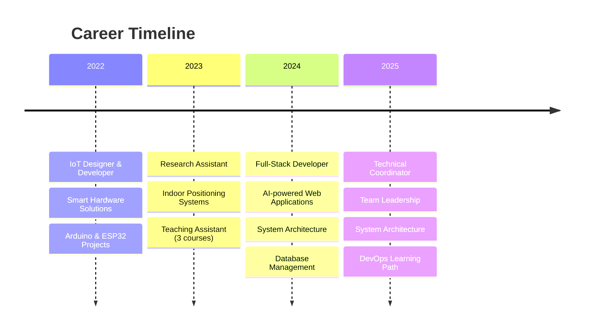

<div align="center">
  
# 👋 Hi, I'm Ali Mahdi Bahrami
### 💻 Software Developer

[](https://git.io/typing-svg)

[](https://www.linkedin.com/in/alimahdibahrami/)
[](https://github.com/alimahdibahrami)
[](https://github.com/alimahdibahrami)

</div>

---

## 🚀 About Me

<div align="center">

```yaml
🎯 Role: Software Developer & Technical Coordinator
🏢 Company: Smart Software Lab
⏰ Experience: 3+ years in software development
🎓 Education: Computer Engineering Graduate
🔬 Research Focus: Indoor Positioning Systems & Machine Learning
💡 Specialties: Full-Stack Development | System Architecture | Team Leadership
🌱 Currently Learning: Advanced AI Applications & DevOps Technologies
📍 Location: Iran 🇮🇷
```

</div>

**Passionate Software Engineer** with expertise spanning **IoT systems**, **full-stack development**, and **system architecture**.

🏆 **What drives me**: Building innovative solutions that bridge cutting-edge technology with real-world applications

---

## 📊 GitHub Analytics

<div align="center">


</div>

<div align="center">
  


</div>

<div align="center">
  


</div>

---

## 🛠️ Tech Stack

<div align="center">

### Backend Development


### Frontend Development


### Bot Development


### IoT & Hardware


### DevOps & Deployment


### Development Tools & Best Practices


### APIs & Communication


</div>

---

## 🏆 GitHub Trophies

<div align="center">
  
[](https://github.com/ryo-ma/github-profile-trophy)

</div>

---

## 📈 Contribution Activity

<div align="center">

[](https://github.com/ashutosh00710/github-readme-activity-graph)

</div>

---

## 🔥 Streak Stats

<div align="center">
  
[](https://git.io/streak-stats)

</div>

---

## 🌟 What I Do

<div align="center">

| 🔧 **Development** | 🏗️ **Architecture** | 👥 **Leadership** |
|:------------------:|:-------------------:|:-----------------:|
| Full-Stack Web Apps | Reliable Systems | Technical Teams |
| AI-Powered Platforms | Layered & Modular Architecture | Project Management |
| IoT Solutions | Database Design | Code Reviews |
| Telegram Bots | API Development | Mentoring |

</div>

### 🚀 Current Projects
- 🔬 **Research**: Indoor positioning systems using ML and low-power sensors
- 🤖 **AI Integration**: Building intelligent chatbot platforms
- 🏠 **IoT Development**: Smart agriculture and home automation systems
- 👨‍💻 **Team Leadership**: Managing cross-functional development teams

---

## 🎯 Professional Journey



---

## 📚 Education & Research

<div align="center">

| 🎓 **Degree** | 🏛️ **Institution** | 📅 **Period** | 🎯 **Focus** |
|:-------------:|:------------------:|:-------------:|:------------:|
| BSc Computer Engineering | University of Qom | 2020 - 2024 | Software Development |

</div>

### 📖 Teaching Experience
- **IoT Foundations** - Dr. Reza Sepahvand (Fall 2023)
- **Formal Languages & Automata** - Dr. Jalaly (Spring 2023)
- **Statistics & Probability** - Dr. Amiri (Spring 2022)

---

## 💻 Weekly Development Breakdown

---

## 🤝 Let's Connect!

<div align="center">

```ascii
   ╔═══════════════════════════════════════╗
   ║  💼 Open for collaboration           ║
   ║  🚀 Innovative projects              ║
   ║  👨‍🏫 Mentoring opportunities          ║
   ║  📚 Academic research partnerships   ║
   ║  🎯 Technical consulting             ║
   ╚═══════════════════════════════════════╝
```

</div>

<div align="center">

[](https://www.linkedin.com/in/alimahdibahrami/)
[](mailto:alimahdibahrami2001@gmail.com)
[](https://t.me/almb2001)

</div>

💡 **Ask me about**: Full-Stack Development, System Design, IoT, Team Leadership, Academic Research, or Persian Culture!

---

<div align="center">

### 🌟 "Building innovative solutions that bridge cutting-edge technology with real-world applications" 🌟

---

⭐️ From [alimahdibahrami](https://github.com/alimahdibahrami) with ❤️

</div>
